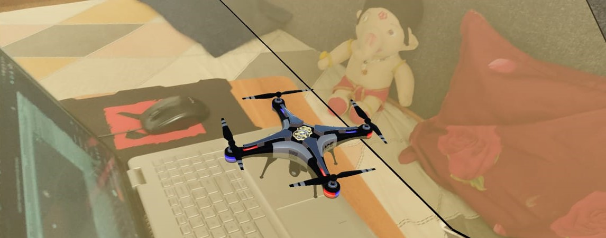

# **AR-Drone Game**
## *An Augmented Reality Drone Game developed using Unity Engine and Google AR Core.*
---
##  This is a tutorial project on Augmented Reality. 
---

---
## Demo Video: [Watch Here](https://drive.google.com/drive/folders/1x2K2qraWcF2z7tRcV4h4-hHzoxunWxoK?usp=sharing)
---
## Preview:

---
## NOTE: Only for Androids supporting Google ARCore.
## Check out yours, here: [Google ARCore Supported Devices](https://developers.google.com/ar/devices)
---
## Install: [Google AR Core](https://play.google.com/store/apps/details?id=com.google.ar.core) 
---
## Try it out here (Download APK) : [AR-Drone Game APK](https://drive.google.com/file/d/1Y2HCvFQcZaecN8MKOHqivsF0OB9oG0n9/view?usp=sharing)
---

## Connect with me on LinkedIn: **[Anubhav Madhav](https://www.linkedin.com/in/anubhav-madhav/)**
---
## Thank You!!
---

